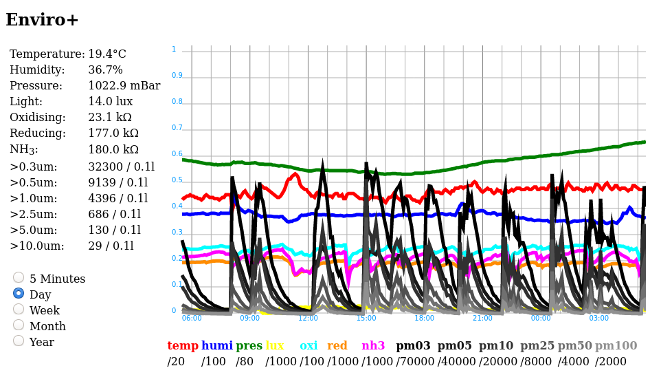

# EnviroPlusWeb

This Fork:
- Changed the drop-down menu into radio buttons for touchscreen convenience.
- Changed the on-board display to only show the temperature, filling the entire screen in the format: 19.4 C
- Adapted the Min / Max values of each key for indoor use.
- Changed the value plot (colored) lines to appear thicker, while the background lines remain the same.
- Changed the Keys on the bottom of the page to bold text (temp, humi, pres, etc).
- Removed the time/date, fan control, css and favicon from the interface.

